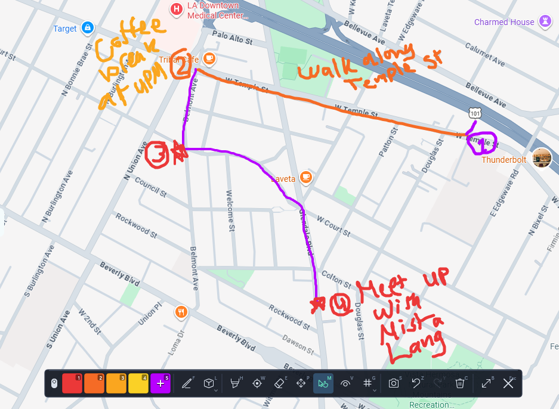
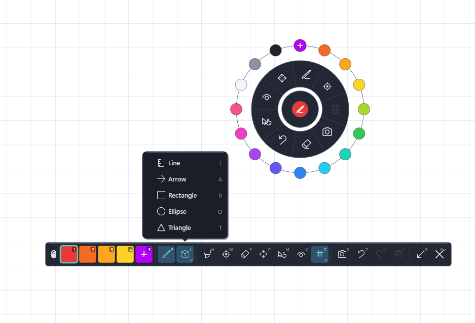

# WinDraw - Screen Inking & Annotation

A complete, zero-bloat, hardware-accelerated screen annotation and drawing suite running directly inside `explorer.exe` powered by **Direct2D**, **DirectWrite**, and **Windows Imaging Component (WIC)**.

---

## Preview

---

## Highlights & Features

1. **Instant Activation & Dismissal**:
   - Press **`Ctrl + Alt + G`** (customizable) anywhere in Windows to begin annotating immediately.
   - Press **`ESC`** or click the **`✕`** Exit button to dismiss the overlay.

2. **Hardware-Accelerated Inking & Brushes**:
   - 144Hz+ butter-smooth Direct2D drawing with quadratic Bézier curve interpolation.
   - **Pen Mode** (`F` key): Solid color inking with subpixel accuracy.
   - **Highlighter Mode** (`H` key): Translucent alpha-blended highlighting.
   - Mouse wheel or **`[`** / **`]`** keys dynamically resize brush thickness with a real-time 1:1 circular indicator dot showing active color and zoom level.

3. **Shapes & Geometry**:
   - **Freehand** (`F` key)
   - **Straight Line** (`L` key)
   - **Arrow** (`A` key) with automatically oriented sharp arrowheads
   - **Rectangle / Box** (`R` key)
   - **Ellipse / Circle** (`O` key)
   - **Triangle** (`T` key)
   - Hold **`Shift`** while drawing to snap lines to 45° increments or constrain rectangles and ellipses to perfect squares and circles.
   - Floating **Shapes Flyout Modal** for quick visual selection.

4. **Custom Color & Opacity Studio**:
   - Click the **`+`** slot in the toolbar to open the full-fledged **Color Studio**.
   - Interactive 2D Saturation-Value picker and continuous 360° Hue spectrum slider.
   - Live **Opacity / Alpha** slider (5% to 100%).
   - One-click **Eyedropper** tool to sample any pixel color directly from your desktop.
   - Hex code display with **Copy to Clipboard** button.
   - Stores and displays your **Last 5 Recent Colors** palette across sessions.

5. **Circular Radial Quick Menu**:
   - **Quick Right-Click Tap**: Opens a sleek circular radial menu centered at your cursor with an orbital color ring, quick tools, and smooth sector hover animations.
   - **Layer 2 Satellite Fan**: Hover over the top Recent Colors hub to smoothly fan out your latest 5 custom colors in an orbital satellite arc.
   - **Hold & Move Right Mouse Button**: Instant stroke-level eraser with circular radius indicator.

6. **Collapsible Floating Toolbar & Status Pill**:
   - Windows 11 Fluent dark acrylic styling with specular highlights and subtle group dividers.
   - Drag the toolbar anywhere on your multi-monitor desktop.
   - **Minimize Button (`B` key)**: Collapses the full bar into an ultra-compact status pill showing active ink color and grip handle.
   - Click the pill in-place to expand it, or drag the pill to park it anywhere on screen.

7. **Vanishing Neon Laser Pointer (`D` key)**:
   - High-visibility neon glowing laser pointer bead with multi-tier glow aura.
   - Temporary fading laser trails that dissolve smoothly after a configurable duration (200ms to 5000ms).
   - Scroll wheel while in Laser mode instantly adjusts trail persistence.

8. **Interactive Grid System (`G` key)**:
   - Dot Grid, Squared Graph Grid, Engineering Grid, and Isometric 3D Triangle Grid overlays.
   - Flyout modal allows switching styles and toggling density between Low, Medium, and High.

9. **Region Snipping & Full Screenshots**:
   - **Full Snapshot** (`S` or `Ctrl + S`): Captures the annotated screen to the Windows clipboard (`CF_BITMAP`) and auto-saves to `%USERPROFILE%\Pictures\WinDraw\`.
   - **Region Snip** (`Ctrl + Shift + S`): Click and drag a selection rectangle to crop and copy/save a specific screen region.

10. **Pan & Zoom Canvas Navigation**:
    - **Pan Mode** (`P` key): Click and drag to reposition drawings across large canvases.
    - **Canvas Zoom**: While holding Pan or using the mouse wheel, smoothly zoom in and out (15% to 800%) centered on the cursor.
    - **Reset View**: Press `0` or `Ctrl + 0` to reset zoom to 100% and pan offset to (0, 0).

11. **Pointer / Click-Through Mode (`M` key)**:
    - Allows interacting with underlying Windows applications and games while keeping your drawings overlaid.

12. **Ink History & Visibility**:
    - **Undo** (`Ctrl + Z`) and **Redo** (`Ctrl + Y`).
    - **Clear All** (`C` key) with full undo support.
    - **Hide/Show Ink** (`V` key): Temporarily toggles drawing visibility without clearing strokes.

---

## Keyboard Shortcuts Reference

| Shortcut | Action |
|---|---|
| **Ctrl + Alt + G** | Activate / Open WinDraw Overlay (Customizable) |
| **ESC** | Dismiss / Close WinDraw Overlay |
| **F** | Freehand Pen Tool |
| **H** | Highlighter Tool |
| **D** | Vanishing Neon Laser Pointer |
| **E** | Eraser Tool (or hold Right Mouse Button) |
| **L** | Straight Line Shape |
| **A** | Arrow Shape |
| **R** | Rectangle Shape |
| **O** | Ellipse / Circle Shape |
| **T** | Triangle Shape |
| **P** | Pan Canvas Mode |
| **M** | Pointer (Click-Through) Mode |
| **G** | Toggle Grid Overlay Flyout |
| **B** | Collapse / Expand Toolbar Pill |
| **Ctrl + Shift + B** | Reset Toolbar Position to Primary Screen Center |
| **V** | Toggle Ink Visibility (Show/Hide) |
| **C** | Clear All Drawings |
| **Ctrl + Z** | Undo last stroke |
| **Ctrl + Y** | Redo last undone stroke |
| **S** / **Ctrl + S** | Take Full Screen Snapshot & Copy to Clipboard |
| **Ctrl + Shift + S** | Region Snipping Tool |
| **[** / **]** | Decrease / Increase Brush Size (or Laser Trail) |
| **0** / **Ctrl + 0** | Reset Canvas Zoom & Pan |
| **1 - 4** | Select Preset Colors (Red, Blue, Green, Yellow) |
| **5** | Open Custom Color & Opacity Studio |

---

## Installation

1. Install [Windhawk](https://windhawk.net/).
2. Search for **WinDraw** in the Windhawk mod manager or install from the online catalog.
3. Once loaded, press **`Ctrl + Alt + G`** to start drawing.

---

## License

This project is released under the [MIT License](LICENSE).
